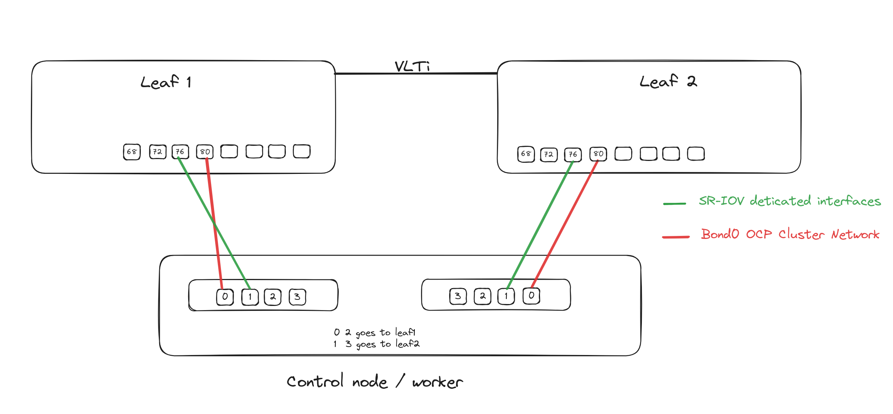

#### Lets test to see what the maxium MTU allowed by the NIC in bond0

```shellsession
korros@silverwolf:~/Documents/projects/nymeria-build-v4$ for x in $(oc get nodes | awk 'NR > 1 {print $1}'); do oc debug node/control-plane1.nymeria.greywind.lab -- bash -c 'ip link show master bond0 | awk -F ": " '\''{print $2}'\'' | grep -v "^$" | xargs -I % ip -d link list dev % | grep -E "minmtu|maxmtu" | awk '\''{for(i=1;i<=NF;i++) if($i=="minmtu") min=$(i+1); else if($i=="maxmtu") max=$(i+1); if(min && max) print "minmtu " min " maxmtu " max; min=""; max=""}'\''';done
Temporary namespace openshift-debug-cpwhb is created for debugging node...
Starting pod/control-plane1nymeriagreywindlab-debug ...
To use host binaries, run `chroot /host`
minmtu 60 maxmtu 9600
minmtu 60 maxmtu 9600

Removing debug pod ...
Temporary namespace openshift-debug-cpwhb was removed.
Temporary namespace openshift-debug-pvt89 is created for debugging node...
Starting pod/control-plane1nymeriagreywindlab-debug ...
To use host binaries, run `chroot /host`
minmtu 60 maxmtu 9600
minmtu 60 maxmtu 9600

Removing debug pod ...
Temporary namespace openshift-debug-pvt89 was removed.
Temporary namespace openshift-debug-vkjrd is created for debugging node...
Starting pod/control-plane1nymeriagreywindlab-debug ...
To use host binaries, run `chroot /host`
minmtu 60 maxmtu 9600
minmtu 60 maxmtu 9600

Removing debug pod ...
Temporary namespace openshift-debug-vkjrd was removed.

```

For the switch side we are connected to a PowerSwitch S5296F-ON running OS10 10.5.5.7.

Per the documentation default MTU is set to 9216.
[OS10 MTU Configuration](https://www.dell.com/support/manuals/en-us/smartfabric-os10-emp-partner/smartfabric-os-user-guide-10-5-5/default-mtu-configuration)

Lets confirm
```shellsession
leaf1-5296# show default mtu
  
Default MTU 9216 bytes
leaf1-5296# show interface ethernet 1/1/80 | grep MTU
MTU 9216 bytes, IP MTU 9184 bytes

```

We should be able to check with this..
```shellsession
[core@control-plane1 ~]$ ping -M do -s 8972 192.168.100.254
PING 192.168.100.254 (192.168.100.254) 8972(9000) bytes of data.
ping: local error: Message too long, mtu=1500
ping: local error: Message too long, mtu=1500
ping: local error: Message too long, mtu=1500
ping: local error: Message too long, mtu=1500
ping: local error: Message too long, mtu=1500
```
*This should work, need to follow up.*
